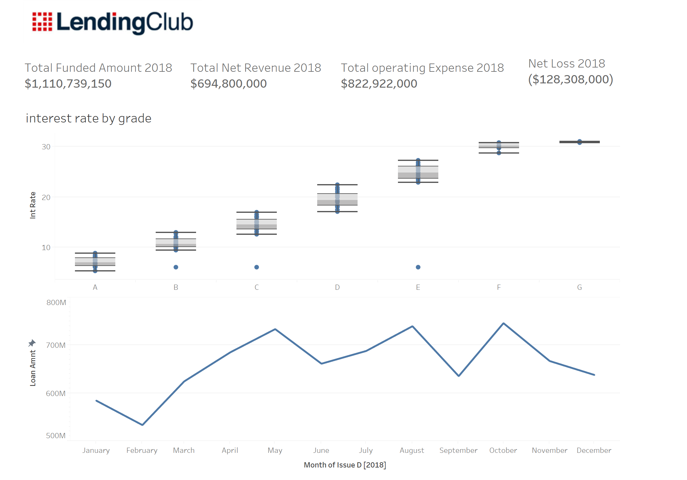
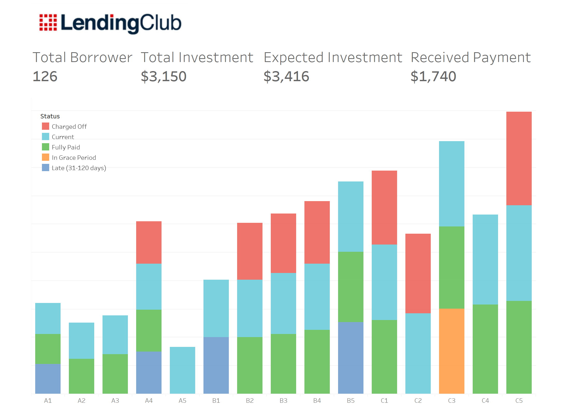
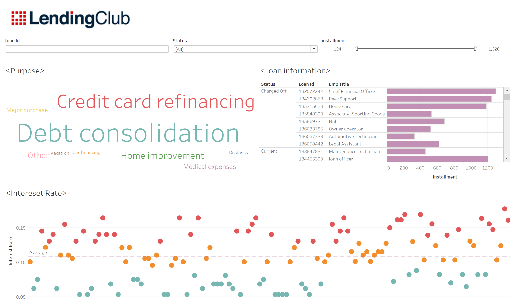

# Individual-Financial-Investment-Report
This is the final project for the data visualization class.

## Introduction
The class instructor asked us to build a dashboard report to help him understand his investment performance on a P2P platform.

## Data Source
The dataset was provided by the class instrcutor,containing data from 2018-2019.  
*For credential resaon, dataset isn't uploaded.*

## Challenge & Solution
**Challenge:** The dataset contained more than 100 messy fields and almost every field's name was unreadable.  
**Solution:** We evenly split the dataset into three parts, each teammate processed one part and extracted usable fields. Then we gathered all the useful fields together.

## Conclusion
The investment income seemed not that pleasant than our instructor expected. We didn't recommend P2P lending as a way to get robust and quick wealth growth.  
**It's a lont-time investment.** 80%+ of the borrowers chose to pay back within 3 years, the left ones decided to pay back in 2 years. Our instructor only got less than half of his money back after lending out for a year. 
**Not low risk** Around 15% of the borrowers didn't pay back in time/didn't give the money back. Though our instructor set the maximum amount of money to be lent out per person, there was no limit for the number of people that could borrow money from him. Thus, the risk would increase when more people try to borrow money from him.

## Dashboards
Because the Tableau workbook is too large, it cannot be uploaded. Thus, I took three screenshots of them. 
**The overall performance of the P2P platform** 
  
**Individual investment overall performance**  

**More details**  

